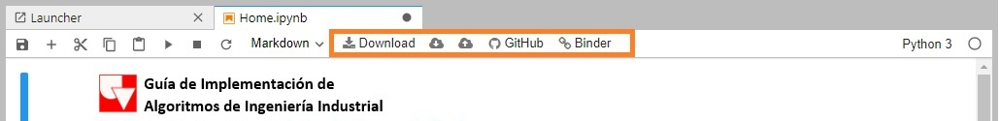

## **1.4 Instrucciones Guía Interactiva** 

---
[1.4.1. Opciones principales](#1.4.1_Opciones)  
[1.4.2. Tipos de Bloques](#1.4.2_Tipos-de-bloques)  
[1.4.3. Descargas](#1.4.3_Descargas)  

---

Esta guía es una colección de Notebooks de JupyterLab, almacenadas en un repositorio en Github, y convertidas a un entorno interactivo a través de Binder, por lo cual, el menú tiene prácticamente las mismas opciones que un Notebook normal de Jupyter, como se vio en el apartado 1.3.3 JupyterLab, y adicionalmente tiene un link para visitar el repositorio, y copiar el link de la página.

###### *Figura 1: Menú Binder*

#### 1.4.1. Opciones principales 

| **OPCIÓN** |  | **DESCRIPCIÓN** |
| :--------: | :-------: |:------- |
|| |Ejecutar bloque de código (Ctrl+Enter)|
|| |Insertar bloque de código|
|| |Restaurar el Kernel|

#### 1.4.2. Tipos de Bloques 

La guía tiene tres tipos de bloques:
1. Texto: Bloque en markdown. (No modificar)
2. Ejemplos: Bloque de código editado con markdown. (No modificar)
3. Consolas vacías: Bloque de código. (Modificar)

Todos los bloques se pueden modificar, pero no tiene sentido modificar los dos primeros, ya que, se estaría cambiando el contenido de la guía, para experimentar modificando los ejemplos, y hacer los ejercicios propuestos están las consolas vacías, que se presentan a lo largo de la guía, o ser insertadas en el notebook si se considera necesario.

#### - Recomendaciones

- Revise en la esquina superior derecha que el Kernel de Python 3 este activado.
- Ejecutar los ejemplos: Al encontrarse con un ejemplo ejecútelo.
- **No** nombrar variables igual que las creadas en el notebook: Se puede generar un conflicto, recuerde que los bloques de código no son independientes, es decir, que hay que hacer de cuenta que están escritos en solo documento.py.
- Evitar copiar y pegar código: La mejor manera de aprender un lenguaje de programación es escribiéndolo, por lo tanto, no es aconsejable reciclar código.
- En caso modificar o eliminar accidentalmente un bloque, vuelva a cargar la página.

#### 1.4.3. Descargas

En el caso de que no pueda acceder al contenido Online, la guía también tiene una versión interactiva descargable, y una versión en PDF. 
 - `*` [Versión descargable]() `*`
 - `*` [Versión en PDF]() `*`

| [**Anteriror**](../1_3_Algunos_IDE/1_3_1_IDLE/1_3_1_IDLE.ipynb#1.3_Algunos_IDE) <!--(https://mybinder.org/Algunos-IDE/Jupyter)--> | - | [**Siguiente**](../../2_Elementos_Basicos/2_Elementos_Basicos.ipynb#2_Elementos-Basicos) <!--(https://mybinder.org/)--> |
| :--------: | :-------: | :--------: |

| [**Home**](../../Home.ipynb#Home)<!--(https://mybinder.org/Home)--> |
| :--------: |
