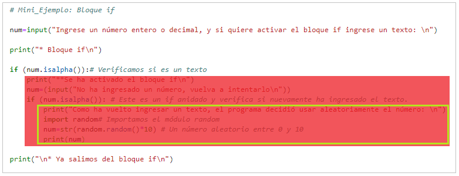

<a id='3_Estructuras-Logicas'></a>
# 3. Estrucutras Lógicas

---
### [3.1 Estructuras de Decisión](#3.1_Estructuras-de-Decision)
>[3.1.1. Bloque if](#Min-eje_Bloque-if)  
>>[3.1.1.1. Indentación](#3.1.1.1_Indentacion)  

>[3.1.2. Bloque if - else](#Min-eje_Bloque-if-else)  
[3.1.3. Bloque if - elif - else](#Min-eje_Bloque-if-elif-else)  

### [3.2 Operadores](#3.2_Operaradores)
>[3.2.1. Operadores de Comparación](#Min-eje_Operadores-de-Comparacion)  
[3.2.2. Operadores Lógicos](#Min-eje_Operadores-Logicos)  
[3.2.3. Operadores de Pertenencia](#Min-eje_Operadores-de-Pertenencia)  
[3.2.4. Operadores de Identidad](#Min-eje_Operadores-de-Identidad)  
[3.2.5 Métodos is...](#3.2.5_Metodos-is)  

---

## **3.1 Estructuras de Decisión** <a id='3.1_Estructuras-de-Decision'></a>

Son una estructura de control basada en condicionales, con las cuales el programa puede tomar decisiones dependiendo del cumplimiento de un conjunto de condiciones.

Por lo tanto, si se quiere lograr que un grupo de instrucciones se ejecuten solamente cuando se cumplen ciertas condiciones, se debe usar esta estructura que ejecutará o no las instrucciones que contenga dependiendo del resultado de la expresión lógica a la que esté sujeto.

**Variables booleanas:** 

`True` o `False` son las variables tipo booleano, usadas para evaluar expresiones lógicas:
- Si la expresión es verdadera entonces es `True`
- Si la expresión es falsa entonces es `false`

**Tipos de bloque:** 

- **Bloque if:** Evalúa una condición y ejecutar instrucciones si esta se cumple, es decir, si tiene un valor True.
- **Bloque elif:** Evalúa una nueva condición, si las condiciones anteriormente evaluadas no se cumplen.
- **Bloque else: No** evalúa condiciones propias, **sólo ejecuta** las instrucciones si no se han cumplido ninguna de las condiciones anteriormente evaluadas con el if o los elif.

## 3.1.1. Bloque if  <a id='Min-eje_Bloque-if'></a>

~~~python
# Mini_Ejemplo: Bloque if  

num=input("Ingrese un número entero o decimal, y si quiere activar el bloque if ingrese un texto: \n")

print("* Bloque if\n")

if (num.isalpha()):# Verificamos si es un texto
    print("**Se ha activado el bloque if\n")
    num=(input("No ha ingresado un número, vuelva a intentarlo\n"))
    if (num.isalpha()): # Este es un if anidado y verifica si nuevamente ha ingresado el texto.
        print("Como ha vuelto ingresar un texto, el programa decidió usar aleatoriamente el número: \n")
        import random# Importamos el módulo random
        num=str(random.random()*10) # Un número aleatorio entre 0 y 10
        print(num)
    
print("\n* Ya salimos del bloque if\n") 
~~~


```python
# Pase aquí el mini ejemplo anterior
```

### 3.1.1.1 Indentación <a id='3.1.1.1_Indentacion'></a>

En Python la indentación o sangría es de vital importancia, ya que, la usa para delimitar los diferentes bloques del programa, a diferencia de otros lenguajes que hacen uso del punto y coma  `;`, ni de las llaves `{}`. Entonces si se usa incorrectamente la indentacion la computadora no va a saber que está dentro y fuera de bloque, estos bloques pueden ser [estructuras de decisión](#3.1_Estructuras-de-Decision), `*`[estructura de repetición](#Estructuras-de-Repeticion), `*`[funciones](#), entre otros.

Por ejemplo, el Mini_Ejemplo anterior tiene tres bloques anidados (uno dentro de otro), el bloque principal (fondo blanco) con indentación nivel 0, el primer bloque if (fondo rojo) con indentación nivel 1, y el segundo bloque if (cuadro verde) con indentación nivel 2. 



#### Indentación incorrecta

Cuando no se indenta correctamente puede ocurrir dos cosas:

##### 1. Las instrucciones no se ejecutan correctamente:
En el siguiente Mini_Ejemplo la edad faltante solo se debería mostrar si es menor de edad, sin embargo, al ingresar un número mayor o igual a 18 el programa se sigue ejecutando y arroja una edad faltante negativa. <a id='Min-eje_Mala-Indentacion'></a>

~~~python
# Mini_Ejemplo: Mala Indentación

## Ingreso de datos:
edad=input("Por favor introduzca su edad")

## Pequeña validación de datos:
if not(edad.isnumeric()):
    import random
    edad=random.randint(0,36)
    print("Ha ingresado un dato inválido, se decidió utilizar la edad:",edad)

edad=int(edad) ## Conversión

años_faltantes=18-edad ## Cálculo de años faltantes para ser mayor de edad

## Evaluación del condicional e impresión de resultados.
if (edad<18):
    print("La edad debe ser mayor a 7 años")
    
print("Le faltan",años_faltantes,"para ser mayor edad")
~~~


```python
# Pase aquí el mini ejemplo anterior
```

##### 2. Al compilar arroja *Identation Error*: <a id="Min-eje_Error-de-Identacion"></a>

~~~python
# Mini_Ejemplo: Error de Indentación

edad=17
estatura=1.63

if (edad<=7):
    print("La edad debe ser mayor a 7 años")
    if (estatura<=1.50):
    print("La estatura debe de ser mayor de 1.50m")

">>> IndentationError: unindent does not match any outer indentation level"
~~~

## 3.1.2. Bloque if - else <a id='Min-eje_Bloque-if-else'></a>
~~~python
# Mini_Ejemplo: Bloque if - else

print("* Bloque if - else\n")

if (float(num)%1!=0):#Validamos si es un número decimal
    print("Este es un número decimal\n")
else: 
    print("Este número es un enetero\n")
    
print("* Aquí se terminó de evaluar el bloque if - else\n")
    
print("\n* Ya salimos del bloque if - else\n") 
~~~
###### **Nota:** Para ejecutar este bloque hay que ejecutar el [Mini_Ejemplo:Bloque if](#Min-eje_Bloque-if)


```python
# Pase aquí el mini ejemplo anterior
```

## 3.1.3. Bloque if - elif - else <a id='Min-eje_Bloque-if-elif-else'></a> 
~~~python
# Mini_Ejemplo: Bloque if - elif - else

num=input("Por favor ingrese un número entero entre 1 y 6\n")

print("""* Bloque if - elif - else""")

if (num.isalpha()):
    print("Ha Ingresado un texto, vuelva a intentarlo\n")
elif((float(num)%1)!=0):# Si no es un texto validamos si es un número decimal
    print("Ha ingresado un numero decimal, vuelva a intentarlo con un entero\n")
elif(float(num)<1):# Si no es un texto ni un decimal validamos si es menor que 1.
    print(num+" es un número menor que 1, vuelva a interalo\n")
elif(float(num)>6):# Si no es un texto ni un decimal, y no es menor que 1, validamos si es mayor a 6
    print(num+" es un número mayor que 6, vuelva a intentarlo\n")    
else:#Si no es ninguna de las anteriores (texto,decimal,menor a 1, mayor a 6)
    print("Ha ingresado un número válido, muchas gracias\n")
    
print("* Aquí se terminó de evaluar el bloque if - elif - else") 
~~~


```python
# Pase aquí el mini ejemplo anterior
```

## **3.2 Operadores** <a id='3.2_Operaradores'></a>

## 3.2.1. Operadores de Comparación <a id='Min-eje_Operadores-de-Comparacion'></a> 

| OPERADOR | DESCRIPCIÓN |
| :--------: | :-------: |
| == | Igual que |
| != | Diferente que |
| > | Mayor que |
| < | Menor que |
| >= | Mayor o igual que |
| <= | Menor o igual que |

~~~python
# Mini_Ejemplo: Operadores de Comparación

## Ingreso de datos:
import random
num1=random.randint(0,1000)
num2=input("Por favor ingrese un número\n")

## Pequeña validación de datos:
if num2.isalpha():
    num2=random.randint(0,1000)
    print("Ha ingresado un texto!\nEl número será escogido por el programa:\nNúmero= ",num2)

## Conversión:
num2=float(num2)   

## Operaciones de comparación:
igual=num1==num2
diferente=num1!=num2
mayor=num1>num2
menor=num1<num2
mayor_igual=num1>=num2
menor_igual=num1<=num2

## Imprimir los resultados:
comparaciones=[[igual," == "],[diferente," != "],[mayor," > "],[menor," < "],[mayor_igual," >= "],[menor_igual," <= "]]

print("Los resultados de las comparaciones son las siguientes")
for i in comparaciones:
    print(num1,i[1],num2,": ",i[0])
~~~


```python
# Pase aquí el mini ejemplo anterior
```

## 3.2.2. Operadores Lógicos <a id='Min-eje_Operadores-Logicos'></a>

| OPERADOR | DESCRIPCIÓN | VALOR DE VERDAD |
| :--------: | :------- | :-------|
| and | Une dos condiciones | Es verdadero cuando todas las condiciones son verdaderas, y es falso cuando alguna de las condiciones es falsa |
| or | Excluye las condiciones | Es verdadero cuando alguna de las condiciones o todas son verdaderas, y es falso cuando las todas son falsas|
| not | Niega una condición | Es verdadero cuando la condición es falsa, y es falso cuando la condición es verdadera|

~~~python
# Mini_Ejemplo: Operadores Lógicos

## Ingreso de datos:
import random
num3=input("Por favor ingrese un número entero entre 1 y 6 o un decimal entre 0 y 1\n")

## Pequeña validación de datos:
if (num3.isalpha()):
    a, b=random.randint(1,6),random.random()
    num3=random.choice([a,b])
    print("Ha ingresado un texto!\nEl número será escogido por el programa:\nNúmero= ",num3) 
    
## Conversión:
num3=float(num3)

## La siguiente condición se cumple si el numero ingresado no es un decimal y está entre 1 y 6 ó es un numero decimal menor que 1.
if( (not(num3%1!=0) and 1<=num3<=6) or (num3%1!=0 and num3<1)):
    print("Ha ingresado un número válido, muchas gracias\n")
else:
    print("Ha ingresado un número inválido, vuelva a intarlo\n")
~~~


```python
# Pase aquí el mini ejemplo anterior
```

## 3.2.3. Operadores de Pertenencia <a id='Min-eje_Operadores-de-Pertenencia'></a>

| OPERADOR | DESCRIPCIÓN | VALOR DE VERDAD |
| :--------: | :------- | :-------|
| in | Pertenece a | Es verdadero si se encuentra el objeto señalado en una cadena, lista, tupla...|
| not in | No pertenece a | Es verdadero si **no se encuentra** el objeto señalado en una cadena, lista, tupla...|

~~~python
# Mini_Ejemplo: Operadores de Pertenencia

entrada=input("Por favor ingrese una cadena de texto que tenga las letras 'c' y 'o' separadas\n")

## La siguiente condición se cumple si: Se ingresa una cadena que no tenga números, tiene las letras 'c' y 'o', y que no tenga las sílabas "co" y "oc".

if(not(entrada.isalnum()) and ("c" in entrada) and ("o" in entrada) and ("co" not in entrada) and ("oc" not in entrada)):
    print("Ha ingresado una cadena válida, muchas gracias\n")
else:
    print("No ha ingresado una cadena válida, vuelva a intentarlo\n")
~~~


```python
# Pase aquí el mini ejemplo anterior
```

## 3.2.4. Operadores de Identidad <a id='Min-eje_Operadores-de-Identidad'></a>

| OPERADOR | DESCRIPCIÓN | VALOR DE VERDAD |
| :--------: | :------- | :-------|
| is | Es | Es verdadero si las referencias en ambos lados del operador apuntan al mismo objeto|
| not is | Es | Es verdadero si las referencias en ambos lados del operador **no apuntan** al mismo objeto|

~~~python
# Mini_Ejemplo: Operadores de Identidad

objeto_1=[]
objeto_2=objeto_1
objeto_3=[]

## La siguiente condición se cumple si: El objeto 1 y 2 son iguales, y el objeto 1 y 3 son diferentes.

if (objeto_1 is objeto_2) and (objeto_1 is not objeto_4):
    print("Como objeto_1 y objeto_2 son el mismo objeto, si cambiamos objeto_2, automáticamente cambiamos objeto_1")
    objeto_2.append("modificación_1")
    print("Ahora el objeto_2 es igual a:",objeto_2)
    print("Y el objeto_1 es igual a:",objeto_1,"\n")
    
    print("Igualmente, si modificamos el objeto_1, se modifica el objeto_2")
    objeto_1.append("modificación_2")
    print("Ahora el objeto_1 es igual a:",objeto_1)
    print("Y el objeto_2 es igual a:",objeto_2,"\n")
    
    print("Y como objeto_3 y objeto_4 no son el mismo objeto, si cambiamos uno de ellos no vamos a cambiar el otro")
    print("El objeto_3 sigue siendo una lista vacía",objeto_3,", aunque el objeto_1 haya sido modificado 2 veces y ahora es igual a: ",objeto_1)
~~~


```python
# Pase aquí el mini ejemplo anterior
```

Retomando la analogía de las etiquetas mencionada [aquí](../2_Elementos-Basicos/2_Elementos-Basicos.ipynb#Entiende-las-variables "¿Cómo entiende Python las variables?"), cuando el operador `is` es verdadero es porque un solo objeto tiene pegadas dos etiquetas, por eso, las dos referencian el mismo objeto y se puede decir que **son** los mismo, es como si una persona tuviera dos nombres, como Jose Ignacio, entonces si algo le seucede a Jose, naturalmente, también le secedió lo mismo a Ignacio. 

En el caso del objeto 1 y 3, cada etiqueta `objeto_1` y `objeto_2` referencian dos objetos aparte, aunque estos sean equivalentes, es como si los objetos fueran gemelos, uno llamado Jose y otro llamado Ignacio, al nacer son iguales, pero el que le suceda algo a Jose no significa que le haya sucedido lo mismo a Ignacio, porque, aunque son iguales son la misma persona, es decir, no comparten la misma identidad.

## 3.2.5 Métodos is... <a id="3.2.5_Metodos-is"></a>

Como se vio en el apartado [2.3. Ayuda y Directorio](../2_Elementos_Basicos/2_Elementos_Basicos.ipynb#2.3_Ayuda-y-Directorio "Ir al apartado 2.3. Ayuda y Directorio"), existen algunas expresiones que arrojan resultados booleanos, como isnumeric( ), y en el [Mini_Ejemplo: Bloque if]("Min-eje_Bloque-if") isalpha( ), hay método que empiezan por is que suelen comprobar si un objeto pertenece o cumple con determinadas características, y dan como resultado un booleano.

Además de los anteriores algunos de estos métodos para las variables str son: isalnum, isascii, isdecimal, isdigit, isidentifier, islower, isprintable, isspace, istitle, isupper, sin embargo, los más utilizados en la guía son isnumeric e isalpha.

____

| [***Anterior***](../2_Elementos_Basicos/2_Elementos_Basicos.ipynb#2_Elementos-Basicos) <!--(https://mybinder.org/Introducción)--> | - | [***Siguiente***](../4_Bucles_e_Iterables/4_Bucles_e_Iterables.ipynb#4_Bucles-e-Iterables) <!--(https://www.python.org/Programas-en-Python)--> |
| :--------: | :-------: | :--------: |

| [**Home**](../Home.ipynb#Home)<!--(https://mybinder.org/Home)--> |
| :--------: |
