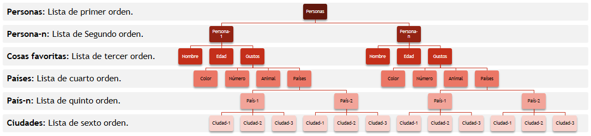

# 5. Estructuras de Datos Básicas <a id='5_Estructura-de-Datos-Basicas'></a>

---
### [5.1. Listas](#5.1_Listas)   
>[5.1.1. Métodos de las Listas](#5.1.1_Metodos-de-las-Listas)  
>>[5.1.1.1. Métodos de Adición](#5.1.1.1_Metodos-de-Adicion)  
[5.1.1.2. Métodos de Eliminación](#5.1.1.2_Metodos-de-Eliminacion)  
[5.1.1.3. Métodos de Orden](#5.1.1.3_Metodos-de-Orden)  
[5.1.1.4. Otros Métodos](#5.1.1.4_Otros-Métodos)  

>[5.1.2. Operaciones](#5.1.2_Operaciones)
>> [5.1.2.1. Máximo y Mínimo](#5.1.2.1_Máximo-y-Mínimo)  
[5.1.2.2. Sumatorias](#5.1.2.2_Sumatorias)  

>[5.1.3. Listas Anidadas](#5.1.3_Listas-Anidadas)  
>> [5.1.3.1. Matrices](#5.1.3.1_Matrices)  
[5.1.3.2 Lista de Orden n](#5.1.3.2_Listas-de-Orden-n)  
[5.1.3.3 Índices en Listas Anidadas](#5.1.3.3_Indices-en-Listas-Anidadas)  
[5.1.3.4 Árboles](#5.1.3.4_Arboles)  

### [5.2. Tuplas](#5.2_Tuplas)   
>[5.2.1. Conversión a Lista](#5.2.1_Conversion-a-Lista)

### [5.3. Diccionarios](#5.3_Diccionarios)   
>[5.3.1. Métodos de los Diccionarios](#5.1.3_Metodos-de-los-Diccionarios)  

---

## **5.1. Listas** <a id='5.1_Listas'></a>  
Mi tipo de estructura de datos favorito en Python es la lista `list`. Como mencioné en el capítulo anterior es un objeto iterable, es similar al array que se usa en otros lenguajes, con algunas características que hacen que su uso sea muy práctico y flexible.

Una lista se crea usando corchetes `{ }` y separando los elementos por comas, cada elemento de una lista puede ser cualquier tipo de objeto. <a id='Min-eje_Lista'></a>

~~~python
# Mini_Ejemplo: Lista

Lista=["1",2,3.4,"cinco",print,True,None,[4,"Toro"]]

for i in Lista:
    print(type(i))
~~~


```python
# Pase aquí el mini ejemplo anterior
```

## 5.1.1. Métodos de las Listas <a id='5.1.1_Metodos-de-las-Listas'></a>
Al ser un iterable como un string, en las listas el [manejo de los índices](../4_Bucles-e-Iterables/4_Bucles-e-Iterables.ipynb#4.1.2_Indices "Ir al apartado 4.1.2_Índices") y los [métodos báiscos](../4_Bucles-e-Iterables/4_Bucles-e-Iterables.ipynb#4.1.1_Metodos-Basicos "Ir al apartado 4.1.1 Metodos Básicos") que se vió en el capitulo anterior (`len`, `count`, e `index`) son iguales, sin embargo, una de las grandes ventajas que tienen las listas es que son objetos mutables, es decir, que se puede cambiar, adicionar, eliminar y ordenar sus elementos, en los siguientes puntos se enseñaran los métodos que permiten hacerlo. <a id='Min-eje_Cambio-de-Elementos'></a>

~~~python
# Mini_Ejemplo: Cambio de Elementos.

cad_enteros=["1","2","3","4","5"]

for i in range(len(cad_enteros)):
    cad_enteros[i]=str(int(cad_enteros[i])+1)+" gatos"
    
print(cad_enteros)
~~~


```python
# Pase aquí el mini ejemplo anterior
```

### 5.1.1.1. Métodos de Adición <a id='5.1.1.1_Metodos-de-Adicion'></a>
- **Append:** <a id='Min-eje_append'></a>
Con este método se puede agregar un elemento al final de la lista, así sea una lista vacía.

~~~python
# Mini_Ejemplo: append

impares=[]

for i in range(1,100,2):
    impares.append(i)
    
print(impares)
~~~


```python
# Pase aquí el mini ejemplo anterior
```

- **Extend:** <a id='Min-eje_extend'></a>
 Este método agrega los elementos de una lista, al final de otra. el siguiente ejemplo muestra como se agreaga a lista_a cada uno de los elementos de la lista_b.
 
~~~python
# Mini_Ejemplo: extend

lista_a=[1,2,3]
lista_b=["a","b","c"]

lista_a.extend(lista_b)

print(lista_a)
~~~


```python
# Pase aquí el mini ejemplo anterior
```

###### **Ojo:** Si se usa el método append en ejemplo anterior, se agregaría la lista_b como un elemento en la lista_a. <a id='Min-eje_append-Lista'></a>
 
~~~python
# Mini_Ejemplo: append Lista

lista_a=[1,2,3]
lista_b=["a","b","c"]

lista_a.append(lista_b)

print(lista_a)
~~~


```python
# Pase aquí el mini ejemplo anterior
```

- **Insert:** <a id='Min-eje_insert'></a>
Con este método es posible agregar a una lista en una posición específica un elemento. Hay que tener especial cuidado con este método ya que requiere tener un correcto [manejo de los índices](../4_Bucles-e-Iterables/4_Bucles-e-Iterables.ipynb#4.1.2_Indices "Ir al apartado 4.1.2_Índices") para no obtener un [error de indexación.](../4_Bucles-e-Iterables/4_Bucles-e-Iterables.ipynb#Min-eje_Error-de-Indexacion "Ir al Mini_Ejemplo: Error de Indexación")

~~~python
# Mini_Ejemplo: insert

lista=[1,5]

lista.insert(1,3) #Insertar en la posición 2, el elmento 1.5. (Recuerde que el índice de la posición 2 es 1).

print(lista)
~~~


```python
# Pase aquí el mini ejemplo anterior
```

### 5.1.1.2. Métodos de Eliminación <a id='5.1.1.2_Metodos-de-Eliminacion'></a>

- **pop:**<a id='Min-eje_pop-con-indices'></a>
Este método elimina un elemento indicando el índice de este, si no se define el índice por defecto se eliminará el último elemento, además de eliminar también guarda en memoria el elemento eliminado, por lo cual si se necesita es posible guardarlos en una variable.

~~~python
# Mini_Ejemplo: pop

lista_a=[1,2,3,4,5,6]

for i in range(len(lista_a)):
    eliminado_a=lista_a.pop()
    print("El elemento eliminado No.",i+1," es:",eliminado_a,"y ahora la lista_a es:",lista_a,"\n")
~~~


```python
# Pase aquí el mini ejemplo anterior
```

<a id='Min-eje_pop-con-indices'></a>
Al igual que con el método insert se debe tener un buen [manejo de los índices](../4_Bucles-e-Iterables/4_Bucles-e-Iterables.ipynb#4.1.2_Indices "Ir al apartado 4.1.2_Índices") para no tener un [error de indexación.](../4_Bucles-e-Iterables/4_Bucles-e-Iterables.ipynb#Min-eje_Error-de-Indexacion "Ir al Mini_Ejemplo: Error de Indexación") 

Se debe tener en cuenta que si elimina un elemento diferente al úlitmo, los índices de la lista van a cambiar, por ejemplo, el siugiente mini ejemplo muestra como eliminar los elementos en las posiciones impares de la lista_b inicial, es decir, los elementos 1, 3, y 5, con los índices [0], [1], [3] respectivamente, sin embargo, estos índices cambiaran una vez se empiecen a eliminar los elementos.

~~~python
# Mini_Ejemplo: pop con índices

lista_b=[1,2,3,4,5,6]
j=0
while j<=len(lista_b)/2:
    eliminado_b=lista_b.pop(j)
    print("Se ha eliminado el elemento",eliminado_b,"con índice",j)
    print("Ahora la lista_b es:",lista_b,"y sus nuevos índices son",list(range(len(lista_b))),"respectivamente\n")
    j+=1
~~~


```python
# Pase aquí el mini ejemplo anterior
```

- **remove:**<a id='Min-eje_remove'></a>
Con este método se puede eliminar el elemento que se indique de la lista, en el siguiente Mini_Ejemplo se va a eliminar todos los elemento diferentes a un entero.

~~~python
# Mini_Ejemplo: remove

lista_c=["Gatos",2,9,3.1,0,"Perros"]

for i in lista_c:
    if type(i)!=int:
        print("El elemento",i,"será eliminado \n")
        lista_c.remove(i)
print("Ahora lista_c es:", lista_c)
~~~


```python
# Pase aquí el mini ejemplo anterior
```

Si se indica un elemento que **no está** en la lista nos va a arrojar un Value Error. <a id='Min-eje_remove-ValueError'></a>
~~~python
# Mini_Ejemplo: remove ValueError

lista_c=["Gatos",2,9,3.1,0,"Perros"]

lista_c.remove(10000)

">>> ValueError: list.remove(x): x not in list"
~~~

- **clear:**<a id='Min-eje_clear'></a>
Este método elimina todos los elementos de la lista.

~~~python
# Mini_Ejemplo: clear

Lista=["1",2,3.4,"cinco",print,True,None,[4,"Toro"]]

Lista.clear()

print("Ahora Lista es:", Lista)
~~~


```python
# Pase aquí el mini ejemplo anterior
```

### 5.1.1.3. Métodos de Orden <a id='5.1.1.3_Metodos-de-Orden'></a>

- **reverse:**<a id='Min-eje_reverse'></a>
Este método modifica la lista y presenta sus elementos en orden invertido.

~~~python
# Mini_Ejemplo: reverse

Lista=["1",2,3.4,"cinco",print,True,None,[4,"Toro"]]

Lista.reverse()

print("Ahora Lista es:", Lista)
~~~


```python
# Pase aquí el mini ejemplo anterior
```

- **sort:**<a id='Min-eje_sort'></a>
Este método ordena de forma ascendente los elementos de la lista, tiene dos parámetros `key` el cual se verá al [Ordenar una "Matriz"](#Min-eje_Ordenar-una-Matriz "Ir al sección") y `reverse`, que sirve cuando se desea ordenar los elementos de forma descendente.

~~~python
# Mini_Ejemplo: sort

lista_d=[1000, 23, 12, 987, 9.76, 51, 0.98]
lista_e=["g","z","m","2","a","0",",",]

lista_d.sort()
lista_e.sort(reverse=True)

print("Ahora lista_d esta ordenada y es:", lista_d)
print("Ahora lista_e esta ordenada de forma descendente y es:", lista_e)
~~~


```python
# Pase aquí el mini ejemplo anterior
```

Aunque las listas pueden tener elemento de tipos diferentes, el metodo sort no puede ordenar una lista que tenga una mezcla de datos numéricos y de texto, si se intenta arrojará un TypeError. <a id='Min-eje_sort-TypeError'></a>

~~~python
# Mini_Ejemplo: sort TypeError

lista_e=["1",2,"5",3,4]

lista_e.sort()

print("Ahora Lista es:", lista_e)

"TypeError: '<' not supported between instances of 'int' and 'str'"
~~~

- **sorted:**<a id='Min-eje_sorted'></a>
Esta función realiza una copia de la lista indicada con sus elementos ordenados en una nueva variable, sin modificar la lista original.

Como muestra el siguiente Mini_Ejemplo, si se intenta hacer con el método `.sort`, modificará la lista original, y no guardará la lista ordenada en la nueva variable.

~~~python
# Mini_Ejemplo: sorted

original_1=[1000, 23, 12, 987, 9.76, 51, 0.98]
original_2=["g","z","m","2","a","0",",",]

copia_1=original_1.sort()
copia_2=sorted(original_2)

print("Ahora original_1 es:", original_1)
print("copia_1 es:",copia_1,"\n")

print("original_2 es:", original_2)
print("copia_2 es:",copia_2)
~~~


```python
# Pase aquí el mini ejemplo anterior
```

### 5.1.1.4. Otros Métodos <a id='5.1.1.4_Otros-Métodos'></a>

- **copy:**<a id='Min-eje_copy'></a>
Este método realiza una copia de la lista indicada en una nueva variable.

Esto es muy importante, porque con las listas se puede incurrir en el error de duplicar una variable, es decir, etiquetar dos veces un mismo objeto, como se explicó en las sección de los [operadores de identidad](../3_Estructuras-Logicas/3_Estructuras-Logicas.ipynb/#Min-eje_Operadores-de-Identidad).

Como se verá en el siguiente ejemplo, al modificar copia_real no se modifica el original, pero si al modificar la copia_falsa el original sufrirá los mismos cambios.

~~~python
# Mini_Ejemplo: copy

original=["1",2,3.4,"cinco"]
copia_real=original.copy()
copia_falsa=original

print("Este es la lista original",original)
print("Esta es la lista copia",copia_real)
print("Esta es la lista copia",copia_falsa,"\n")

copia_real.append("cambio_1")
print("Ahora copia_real es:",copia_real)
print("Y la lista original es:",original,"\n")

copia_falsa.append("camibo_2")
print("Ahora copia_real es:",copia_falsa)
print("Y la lista original es:",original,"\n")
~~~


```python
# Pase aquí el mini ejemplo anterior
```

## 5.1.2. Operaciones <a id='5.1.2_Operaciones'></a>

A continuación se mostrará como retornar el máximo, el mínimo, y la sumatoria de una lista compuesta por datos numéricos, estas operaciones funcionan igual en las [tuplas](#5.2_Tuplas "Ir al apartado 5.2 Tuplas") que verán más adelante.

### 5.1.2.1. Máximo y Mínimo <a id='5.1.2.1_Máximo-y-Mínimo'></a>
Se puede averiguar cual es el valor máximo y mínimo, con las palabras reservadas `max` y `min`. <a id='Min-eje_Maximo-y-Minimo'></a>

~~~python
# Mini_Ejemplo: Máximo y Mínimo

edades=[23,73,74,18,17,59]

edad_maxima=max(edades)
edad_minima=min(edades)

print("La edad máxima es:",edad_maxima)
print("La edad mínima es:",edad_minima)
~~~


```python
# Pase aquí el mini ejemplo anterior
```

### 5.1.2.2. Sumatorias <a id='5.1.2.2_Sumatorias'></a>
Con la palabra reservada `sum` se puede hacer la sumatoria de los elementos de una lista.<a id='Min-eje_Sumatoria'></a>

~~~python
# Mini_Ejemplo: Sumatoria

ingresos=[12.4,30.9,10.5,100,8.5]

ingresos_totales=sum(ingresos)

print("Los ingresos totales son:",ingresos_totales)
~~~


```python
# Pase aquí el mini ejemplo anterior
```

## 5.1.3. Listas Anidadas <a id='5.1.3_Listas-Anidadas'></a>

Las lista anidadas son listas dentro de listas, esta estructura es especialmente útil porque con ella es posible emular la estructrura de una matríz, pirámide, un árbol, etc, lo cual ayuda mucho en el momento de organizar los datos.

### 5.1.3.1. Matrices <a id='5.1.3.1_Matrices'></a>

Una "matríz" es una lista anidada donde las filas son la cantidad de sublistas y las columnas son la cantidad de elementos de las sublistas, es importante que todas las sublistas tengan la misma cantidad de elementos, este es el tipo de lista anidada que más se utilizará en la guía.

###### **Nota:** Si  se necesita tener una matriz aritmética para sumarla, restarla, sacar su determinante, su matriz inversa o su transpuesta, lo mejor es crearla con un módulo matématico como `numpy`.

#### **Coordenadas (x,y) =**
\begin{bmatrix}
 0 & 0 \\ 
 1 & 2 \\
 2 & 4 \\
 3 & 6
\end{bmatrix}

- Por ejemplo, la matriz anterior se puede representar en una lista anidada asi:
~~~python
coordenadas_x_y=[[0,0],[1,2],[2,4],[3,6]]
~~~
o así
~~~python
coordenadas_x_y=[[0,0],
                 [1,2],
                 [2,4],
                 [3,6]]
~~~

- **Recorrer una Matriz:** <a id='Min-eje_Recorrer-una-Matriz'></a>
Para esto hace falta usar dos for anidados, el primero recorre la lista principal con las sublistas, y el segundo recorre los elementos de cada sublistas.

~~~python
# Mini_Ejemplo: Recorrer-una-Matriz

coordenadas_x_y=[[0,0],[1,2],[2,4],[3,6]]

for i in coordenadas_x_y:
    print("Aquí entramos al elemento",i,"y esta sublista tiene los elementos:")
    for j in i:
        print(j,"\n")
~~~


```python
# Pase aquí el mini ejemplo anterior
```

- **Llenar una Matriz:** <a id='Min-eje_Llenar-una-Matriz'></a>

El siguiente ejemplo muestra como crear una matriz que guarde los valores de eseta función, y=x^2, para x=0 hata x=10.

~~~python
# Mini_Ejemplo: Llenar-una-Matriz

coordenadas_x_y=[]

for i in range(11):
    coordenadas_x_y.append([i,i**2])
    
print(coordenadas_x_y)
~~~


```python
# Pase aquí el mini ejemplo anterior
```

- **Ordenar una Matriz:** <a id='Min-eje_Ordenar-una-Matriz'></a>

Si se emplea el método [.sort()](#Min-eje_sort "Ir al ejemplo del metodo sort") del apartado anterior, los elementos de la lista principal quedarán organizados por la primera "columna",es decir, por el indice[0] de las sublistas.

Para organizarla por una columna diferente a la primera se debe hacer uso del parámetro key y la función [Lambda](../6_Funciones/6_Funciones.ipynb#6.1.2_Funcion_Lambda).

~~~python
# Mini_Ejemplo: Ordenar-una-Matriz

matriz=[[4,7,6],
        [1,2,8],
        [5,3,9]]

print("Esta es la matriz original\n",matriz,"\n")

matriz.sort()
print("Este es orden que da por defecto el método .sort(), es decir por la primera columna\n",matriz,"\n")

matriz.sort(key=lambda columna: columna[1])
print("Esta es la matriz ordenada por la segunda columna:\n",matriz,"\n")

matriz.sort(key=lambda columna: columna[2])
print("Esta es la matriz ordenada por la tercera columna:\n",matriz,"\n")
~~~


```python
# Pase aquí el mini ejemplo anterior
```

### 5.1.3.2 Lista de Orden n <a id='5.1.3.2_Listas-de-Orden-n'></a>

En esta guía se van a etiquetar las listas segun el nivel en el que se encuentren, por lo tanto, habrán listas de primer, segundo, tercer, cuarto, quinto orden ...

- Lista de primer orden: Es la lista principal y **no está** contenidad en ninguna otra lista. `[1,2,3,4,5]`
- Lista de segundo orden: Es una lista que está en un lista. `[[1,2,3],["a","b","c"],["uno","dos","tres"]]`
- Lista de tercer orden: Es una lista que está en una lista de segundo orden, es decir, una lista que está en una lista que está en una lista. 
~~~
[
[[1,2,3,4],["uno","dos","tres","cuatro"]], 
[[a,b,c],["araña","buho","cabra"]],
[[0,1,10,11],[0,1,2,3]]
]
~~~
- Es la misma idea para las listas de n orden.

### 5.1.3.3 Índices en Listas Anidadas <a id='5.1.3.3_Indices-en-Listas-Anidadas'></a>

El manejo de los índices en estas listas es multiple, por ejemplo, si se tiene una lista de segundo orden se necesitaran dos, uno para cada lista, [a][b], siendo [a] el índice de los elementos de la lista principal y [b] el índice de los elementos de las sublistas.

De forma análoga, para una lista de tercer orden se necesitan tres índices [a][b][c], de igual manera con las de n orden. <a id='Min-eje_Indices-en-Listas-Anidadas'></a>

~~~python
# Mini_Ejemplo: Índices en Listas Anidadas.

coordenadas_x_y=[[0,0],
                 [1,2],
                 [2,4],
                 [3,6]]

print("coordenadas_x_y=",coordenadas_x_y,"\n")
print("El elemento",coordenadas_x_y[2][1],"tiene índice [2][1]")
~~~


```python
# Pase aquí el mini ejemplo anterior
```

### 5.1.3.4 Árboles <a id='5.1.3.4_Arboles'></a>

Con las listas de orden n se pueden crear esctructuras como árboles o pirámides, el siguiente Mini_Ejemplo muestra una estructura, con listas de cuarto orden, con la cual se emula una estructura de árbol, con la información de tres personas, como muestra el siguiente diagrama.


El siguiente Mini_Ejemplo muestra como recuperar por medio de los índices los elementos, y hacer una comparación entre ellos.

~~~python
# Mini_Ejemplo: Índices en Listas de CuartoOrden

personas=[
    ["Mauricio",28,["azul",73,"tigres",[["Alemania",["Berlín","Hamburgo","Múnich"]],["Escocia",["Edimburgo","Glasgow","Inverness"]]]]],
    
    ["Juliana",45,["azul",8,"delfines",[["Rumania",["Bucarest","Timișoara","Cluj-Napoca"]],["Turquía",["Estambul","Éfeso","Antalya"]]]]],
    
    ["Roberto",18,["negro",0,"pandas rojos",[["Indonesia",["Yogyakarta","Macasar","Surabaya"]],["Japón",["Sapporo","Nagoya","Yokohama"]]]]]
]
   
elemento_recuperado=personas[1][2][3][1][1][1]
print("El índice de",elemento_recuperado,"es [1][2][3][1][1][1]\n")

if personas[0][2][0]==personas[1][2][0]:
    print("El color favorito de",personas[0][0],"y",personas[1][0],"es el mismo.\n")

for i in personas:
    nombre=i[0]
    edad=i[1]
    color=i[2][0]
    numero=i[2][1]
    animales=i[2][2]
    pais_1=i[2][3][0][0]
    ciudad_1_pais_1=i[2][3][0][1][0]
    ciudad_2_pais_1=i[2][3][0][1][1]
    ciudad_3_pais_1=i[2][3][0][1][2]
    pais_2=i[2][3][1][0]
    ciudad_1_pais_2=i[2][3][1][1][0]
    ciudad_2_pais_2=i[2][3][1][1][1]
    ciudad_3_pais_2=i[2][3][1][1][2]
    
    print(nombre,"tiene",edad,"años y le gusta el "+str(color)+", su número favorito es",numero,"y sus animales favoritos son los", animales)
    
    print("Quiere viajar a",pais_1,"y conocer",str(ciudad_1_pais_1)+", "+str(ciudad_2_pais_1)+" y "+str(ciudad_3_pais_1)+".")
    
    print("También quiere ir a",pais_2,"y conocer",str(ciudad_1_pais_2)+", "+str(ciudad_2_pais_2)+" y "+str(ciudad_3_pais_2)+".\n")
~~~


```python
# Pase aquí el mini ejemplo anterior
```

## **5.2. Tuplas** <a id='5.2_Tuplas'></a>

Es una estructura de datos inmutable al igual que las cadenas, es decir que no se puede modificar después de creadas, por lo tanto no se pueden aplicar la mayoria de los métodos de las listas, sin embargo, al igual que en las listas cada elemento de una tupla puede ser cualquier tipo de objeto y simular otras estructuras con listas o tuplas anidadas.

Una tupla se crea usando parentesis `( )` y separando los elementos por comas.

~~~python
tupla = ("1",2,3.4,"cinco",print,True,None,[4,"Toro"],(5,"Loros"))
~~~

- Una de las cosas mas cómunes que se hacen con las tuplas es y listas es asignarle una variable a cada uno de sus elementos.

~~~python
# Mini_Ejemplo: Abrir Tuplas.

tupla=([1,3,5,7,9,11],(2,4,6,8,10,12))
x,y=tupla
print(x)
print(y)
~~~


```python
# Pase aquí el mini ejemplo anterior
```

## 5.2.1. Conversión Lista <--> Tupla <a id='5.2.1_Conversion-a-Lista'></a>
Para convertir un objeto en una lista se va a usar la función `list()`, y para convertirlo en una tupla `tuple()` <a id='Min-eje_Conversion-Lista-Tupla'></a>

~~~python
#Mini_Ejemplo: Conversión-Lista-Tupla

numeros=(1,2,3,4)
vocales=["a","i","u","e","o"]

print("El objeto numeros",numeros,"es de tipo",type(numeros))
print("El objeto vocales",vocales,"es de tipo",type(vocales),"\n")

numeros=list(numeros)
vocales=tuple(vocales)

print("Ahora el objeto numeros",numeros,"es de tipo",type(numeros))
print("Ahora el objeto vocales",vocales,"es de tipo",type(vocales))
~~~


```python
# Pase aquí el mini ejemplo anterior
```

## **5.3. Diccionarios** <a id='5.3_Diccionarios'></a>
Al igual que las lista es una esctructura de datos mutable y con el que se almacena cualquier tipo de objeto, en lo que diferencia es en la manera de acceder a sus elementos, ya que, no es por medio de índices sino de claves `key`.

Un diccionario se crea usando llaves `{ }`, que contienen las parejas de claves y elementos separadas por dos puntos, y separadas de las otras por comas, las claves deben estar entre comillas ya sean dobles o simples. 

En el siguiente ejemplo muestra como crear, recuperar un elemnento y recorrer un diccionario.<a id='Min-eje_Diccionarios'></a>

~~~python
# Mini_Ejemplo: Diccionarios

diccionario={'animal':'mariquita','clase':'insecto','color':{'cantidad':2,'colores':('rojo','negro')}}

print("Para recuperar el elemento",diccionario['clase'],"debemos usar la calve 'clase'\n")

for i in diccionario:
    print(i, diccionario[i])
~~~


```python
# Pase aquí el mini ejemplo anterior
```

## 5.3.1. Métodos de los Diccionarios <a id='5.1.3_Metodos-de-los-Diccionarios'></a>
A continuación están los métodos principales de los diccinarios.

- **dict( ):** <a id='Min-eje_dic'></a>
Es una función que recibe como parámetro una representación de un diccionario, y si es válida, devuelve un diccionario de datos.

~~~python
# Mini_Ejemplo: dict( )

diccionario=dict(marca="Asus",colores=["plata","negro"], puerto_HDM=True)
print(diccionario)
~~~


```python
# Pase aquí el mini ejemplo anterior
```

- **zip( ):** <a id='Min-eje_zip'></a>
Es una función recibe como parámetro dos iterables como una cadena, lista o tupla del mismo tamaño, y devuelve una representación que puede convertida a un diccionario relacionando cada elemento de los iterables.

~~~python
# Mini_Ejemplo: zip()

tupla=("coordenada_x","coordenada_y","coordenada_z")
lista=[[0,1,2,3,4],[5,7,9,11,13],[0,0,1,1,2,2]]

diccionario=dict(zip(tupla,lista))
print(diccionario)
~~~


```python
# Pase aquí el mini ejemplo anterior
```

- **setdefault( ):** <a id='Min-eje_setdefault'></a>
Al igual que el método `.append()` en las listas, con este método se agreaga una pareja clave-elemento a un diccionario.

~~~python
# Mini_Ejemplo: setdefault( )

diccionario={}
print("diccionario:",diccionario,"\n")

parejas=[
    ["biblioteca",("Mario Carvjal","Antio José Escobar")],
    ["comuna",("17","8")],
    ["comentarios_google",[37,3]]
]

for i in parejas:
    diccionario.setdefault(i[0],i[1])
    
print("Ahora el diccionario es:",diccionario,"\n")
~~~


```python
# Pase aquí el mini ejemplo anterior
```

- **pop( ):** <a id='Min-eje_pop'></a>
Al igual que en las listas con este método elimina una pareja clave-valor indicando la clave del elemento a eliminar, sin embargo, en los diccionarios si no se especifica la clave, al correrlo arrojará *TypeError: pop expected at least 1 arguments, got 0*.

~~~python
# Mini_Ejemplo: pop( )

diccionario={'nombre':"Adrian",'turno':("A","B","C"),'horas_extras':2.5}
print("diccionario:",diccionario,"\n")

diccionario.pop('turno')

print("Ahora el diccionario es:",diccionario,"\n")

claves=list(diccionario.keys())

for i in claves:
    diccionario.pop(i)
    
print("Ahora el diccionario es:",diccionario,"\n")
~~~


```python
# Pase aquí el mini ejemplo anterior
```

- **items( ):** <a id='Min-eje_items'></a>
Es un método que convierte diccionario en un tipo de objeto llamado `dict_items`, que es símilar a una lista de tuplas, siendo cada pareja calve-elemento una tupla, sin embargo, si se modifica el diccionario atuomaticamente también se modificará la lista de items, como si los dos objetos estuvieran enlazandos.

~~~python
# Mini_Ejemplo: items()

diccionario={'nombre':"Adrian",'turno':("A","B","C"),'horas_extras':2.5}
print("El diccionario es:",diccionario,"\n")

lista_items=diccionario.items()
print("La 'lista' de items es:",lista_items,"y es objeto tipo",type(lista_items),"\n")

for i in lista_items:
    print(i)
    
diccionario.pop('horas_extras')

print("\n")
print("Ahora el diccionario es:",diccionario)
print("Ahora la 'lista' de items es:",lista_items)
~~~


```python
# Pase aquí el mini ejemplo anterior
```

- **keys( ):** <a id='Min-eje_keys'></a>
Es un método que devuelve un objeto tipo `dict_keys` que es similiar a una lista con las claves de un diccionario, al igual que el método anterior, esta "lista" de claves está enlazada con el diccionario.

~~~python
# Mini_Ejemplo: keys( )

diccionario={'nombre':"Adrian",'turno':("A","B","C"),'horas_extras':2.5}
print("diccionario:",diccionario,"\n")

lista_claves=diccionario.keys()
print("La 'lista' de las claves del diccionario es:",lista_claves,"\n")

for i in lista_claves:
    print(i)
    
diccionario.pop('horas_extras')

print("\n")
print("Ahora el diccionario es:",diccionario)
print("Ahora la 'lista' de items es:",lista_claves)
~~~


```python
# Pase aquí el mini ejemplo anterior
```

- **values( ):** <a id='Min-eje_values'></a>
Es un método que devuelve un objeto tipo `dict_values` que es similiar a una lista con los elementos de un diccionario, como en el método anterior esta "lista" está enlzada al diccionario.

~~~python
# Mini_Ejemplo: values( )

diccionario={'nombre':"Adrian",'turno':("A","B","C"),'horas_extras':2.5}
print("diccionario:",diccionario,"\n")

lista_values=diccionario.values()
print("La 'lista' de los elementos del diccionario es:",lista_values,"\n")

for i in lista_values:
    print(i)
    
diccionario.pop('turno')

print("\n")
print("Ahora el diccionario es:",diccionario)
print("Ahora la 'lista' de items es:",lista_values)
~~~


```python
# Pase aquí el mini ejemplo anterior
```

- **update( ):** <a id='Min-eje_update'></a>

Este método compara las parejas clave-valor de dos diccionarios y actualiza el valor de la claves comúnes entre los dos, en caso de haber parejas nuevas el método las agrega al diccionario base.

~~~python
# Mini_Ejemplo: update( )

diccionario_base={'nombre':"Adrian",'turno':("A","B","C"),'horas_extras':2.5}

diccionario_modificado={'nombre':"Adrian",'turno':("A","B","C"),'horas_extras':3,'dias_incapacidad':1}

print("El diccionario base es:",diccionario_base,"\n")
print("La modificación es:",diccionario_modificado,"\n")

diccionario_base.update(diccionario_modificado)

print("El diccionario actualizado es:",diccionario_base,"\n")
~~~


```python
# Pase aquí el mini ejemplo anterior
```

___

| [***Anterior***](../4_Bucles_e_Iterables/4_Bucles_e_Iterables.ipynb#4_Bucles-e-Iterables) <!--(https://mybinder.org/Introducción)--> | - | [***Siguiente***](../6_Funciones/6_Funciones.ipynb#6_Funciones) <!--(https://www.python.org/Programas-en-Python)--> |
| :--------: | :-------: | :--------: |

| [**Home**](../Home.ipynb#Home)<!--(https://mybinder.org/Home)--> |
| :--------: |
