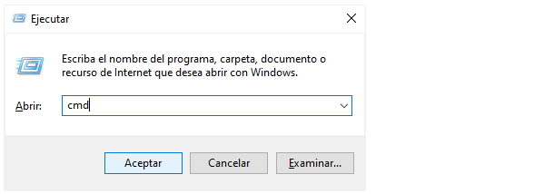
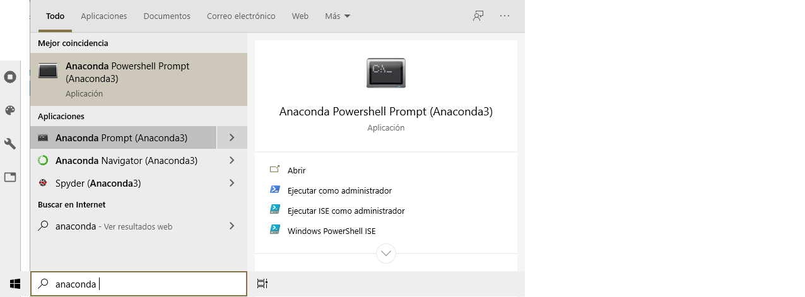
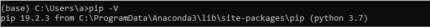
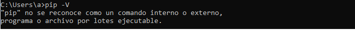
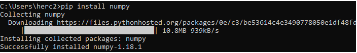
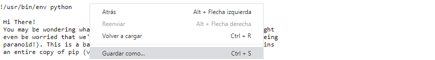

# 9. Módulos y Paquetes <a id='9_Modulos_y_Paquetes'></a>

---
#### [9.1. Módulos](#9.1_Modulos)   
>[9.1.1. Importar Módulos](#9.1.1_Importar-Modulos)      

#### [9.2. Paquetes](#9.2_Paquetes)   
>[9.2.1. Importar Paquetes](#9.2.1_Importar-Paquetes)     

#### [9.3. Librería Estándar](#9.3_Libreria-Estandar)  

#### [9.4. Paquetes de Terceros](#9.4_Paqutes-de-Terceros)   
>[9.4.1. Instalación de Paquetes](#9.4.1_Instalacion-de-Paquetes)   
[9.4.2. Paquetes de SciPy](#9.4.2_Paquetes-de-SciPy)  

---

## **9.1. Módulos** <a id='9.1_Modulos'></a>   
Los módulos son archivos de Python que almacenan diferentes objetos principalmente funciones, clases, constantes y excepciones, para que pueden ser accedidos y usados en otro archivo, en capítulos anteriores ya se han empleado algunos de ellos, como pyplot, pandas, random, math, etc.

Se pueden clasificar en tres tipos dependiendo su origen como: 

- [**Módulos de la librería estándar:**](#9.3_Libreria-Estandar "Ir al apartado de Librería Estándar") Son una gran cantidad de módulos que vienen preinstalados con Python, [aquí]( https://docs.python.org/3/library/index.html "Ir a la documentación de la librería estándar") puede encontrar el listado de ellos.
- [**Módulos de terceros:**](#9.4_Paqutes-de-Terceros "Ir al apartado de Paquetes de Terceros") Es una cantidad aún mayor de módulos creados por la comunidad en Python, los más utilizados de ellos vienen preinstalados con Anaconda, [aquí]() puede encontrar los módulos que vienen con Anaconda, y [aquí](https://pypi.org/ "Ir al Python Package Index") un buscador de paquetes creados por la comunidad.
- **Módulos propios: ** Son los módulos creados por el desarrollador para uso propio, aunque naturalmente pude compartirlo con la comunidad.

Entre las principales ventajas de usar módulos están:

- **Legibilidad y depuración:** Con los módulos se puede dividir un código muy extenso en partes más pequeñas y manejables las cuales son más sencillas de leer, entender, y depurar.
- **Reusabilidad:** Todos los objetos que se tengan guardados en un módulo se pueden volver a utilizar en diferentes proyectos, por lo tanto no hay necesidad de crear desde cero todo el código, por ejemplo, no hay necesidad de crear una función factorial con un for sabiendo que el módulo math ya tiene una.

## 9.1.1. Importar Módulos <a id='9.1.1_Importar-Modulos'></a>  

Existen dos formas de importar un módulo y acceder a sus objetos.

**a. Importar el módulo completo**: Se importa con la palabra reservada `import` y los objetos se deben llamar con el nombre del módulo como prefijo, algunas veces el importe se hace con un alias

~~~python
import math
print(help(math.factorial))
print(help(math.sqrt))

import numpy as np
help(np.arange)
~~~


```python
# Pase el código anterior aquí
```

**b. Importar solo objeto**: Con las palabras reservadas `import` y `from`, con esta forma los objetos **no** se llaman con el nombre del módulo como prefijo.

~~~python
from math import factorial, sqrt
print(help(factorial))
print(help(sqrt))

from numpy import arange
help(arange)
~~~


```python
# Pase el código anterior aquí
```

## **9.2. Paquetes** <a id='9.2_Paquetes'></a> 
Los paquetes son carpetas que almacenan varios módulos y hasta otros paquetes, volviéndose así un sistema de directorios para organizar los archivos de los módulos. Para que Python interprete que la carpeta es un módulo esta debe tener el archivo **\_\_init__.py**, el cual para el desarrollo de la guía basta con que esté en blanco, para conocer más sobre este archivo ingrese [aquí](https://docs.python.org/3/tutorial/modules.html#packages "Ir a la documentación oficial")

Cuando el paquete es muy grande y tiene módulos relacionados entre sí para un área en específico se les llama ecosistema, por ejemplo, [SciPy](https://www.scipy.org/ "Ir a la página oficial de SciPy") es un ecosistema para matemáticas, ciencias e ingeniería.

## 9.2.1. Importar Módulos de Diferentes Paquetes <a id='9.2.1_Importar-Paquetes'></a>  

Al igual que sucede con los archivos, para importar un paquete propio hay que tener en cuenta su [ubicación](../7_Lectura_y_Escritura/7_Lectura_y_Escritura.ipynb#7.1.1_Ubicacion-de-Archivos "Ir al apartado 7.1.1. Ubicación de Archivos"), y usar el paquete sys para acceder a ella.

Suponga que se tiene la siguiente estructura de paquetes:

~~~
Carpeta_superior_1
    |-- __init__.py
    |-- Mod_s1.py
    |-- 9_Modulos_y_Paquetes/
        |-- __init__.py
        |-- validaciones.py
        |-- Estadistica
            |-- __init__.py
            |-- descriptiva.py
            |-- graficos.py
            |-- aleatorios.py          
~~~

**Módulo en nivel superior**
Para importar un módulo que está en una ubicación superior, por ejemplo, si se quiere importar Mod_s1 en [aleatorios.py](Estadistica/aleatorios.py "Ir al archivo") la ruta que se debe usar es **". . / . . /"**. 

- Para importar en aleatorios.py el módulo [validaciones](validaciones.py "Ir al archivo") la ruta es **". . /"**

~~~python
import sys
ruta="../"
sys.path.append(ruta)

import validaciones
dir(validaciones)

from validaciones import v_num_entero
help(v_num_entero)
~~~

**Módulo en nivel inferior**
Para importar un módulo que está en una ubicación inferior, por ejemplo, si se quiere importar [graficos](Estadistica/graficos.py "Ir al archivo") en Mod_s1.py la ruta que se debe usar es **"9_Modulos_y_Paquetes/Estadistica"**.

- Para importar [descriptiva](Estadistica/descriptiva.py "Ir al archivo") en validaciones.py la ruta es **"Estadistica/"**.

~~~python
import sys
ruta="Estadistica/"
sys.path.append(ruta)

import descriptiva
dir(descriptiva)
~~~


```python
# Pase el código anterior aquí
```

#### Mini_Ejemplo: Usar Módulos Propios
<a id='Min-eje_Modulos_Propios'></a>

~~~python
# Mini_Ejemplo: Usar Módulos Propios

from validaciones import v_num_decimal, v_num_entero

import sys
ruta="Estadistica/"
sys.path.append(ruta)

import descriptiva
from aleatorios import normales
import graficos

media=v_num_decimal("Por favor ingrese la media: ")
desv_est=v_num_decimal("Por favor ingrese la desviación estándar: ")

datos=normales(media,desv_est)

d_media, mediana, moda= descriptiva.centramiento(datos)

m_dispercion= descriptiva.dispercion(datos)

rango=m_dispercion[0]
desviacion=m_dispercion[1] 
varianza=m_dispercion[3] 

print("\nLas medidas de los datos son:\n")
print("Media:",round(d_media,2))
print("Moda",moda)
print("Mediana:",round(mediana,2))
print("Rango:",round(rango,2))
print("Desviación Estándar",round(desviacion,2))
print("Varianza:",round(varianza,2),"\n")

graficos.h_comparativo(["Histograma","H.Acumulativo"],[datos,datos],[5,5],["h","ha"],["",""])
~~~


```python
# Pase aquí el mini ejemplo anterior
```

## **9.3. Librería Estándar** <a id='9.3_Libreria-Estandar'></a>   

Para el desarrollo de la guía hay que tener en cuenta los siguientes módulos de la librería estándar.

- [**math**:](https://docs.python.org/3/library/math.html "Ir a la documentación oficial del módulo") Contiene funciones y constantes matemáticas:

~~~python
import math
dir(math)
~~~


```python
# Pase el código anterior aquí
```

- [**random**:](https://docs.python.org/3/library/random.html "Ir a la documentación oficial del módulo") Está compuesto por funciones para generar números aleatorios, con distribuciones de probabilidad o escoger aleatoriamente entre un conjunto de opciones, entre otros.

~~~python
import random
dir(random)
~~~


```python
# Pase el código anterior aquí
```

- [**os**:](https://docs.python.org/3/library/os.html "Ir a la documentación oficial del módulo") Con el se puede interactuar con las funciones del sistema operativo, (como en la terminal). En la guía es usado para interactuar con sistemas de directorios, por ejemplo, [crear una carpeta](../7_Lectura_y_Escritura/7_Lectura_y_Escritura.ipynb#7.2.1_Crear-Carpetas "Ir al apartado 7.2.1 Crear Carpetas")

~~~python
import os
dir(os)
~~~


```python
# Pase el código anterior aquí
```

- [**statistics**:](https://docs.python.org/3/library/statistics.html "Ir a la documentación oficial del módulo") Contiene las funciones estadísticas básicas de medidas de centra miento y dispersión. 

~~~python
import statistics
dir(statistics)
~~~


```python
# Pase el código anterior aquí
```

- [**sys**:](https://docs.python.org/3/library/sys.html "Ir a la documentación oficial del módulo") Contiene funciones para interactuar con variables y funciones usadas o mantenidas por el intérprete he interprete. En la guía será usado para acceder a las rutas de paquetes.

~~~python
import sys
dir(sys)
~~~


```python
# Pase el código anterior aquí
```

## **9.4. Paquetes de Terceros** <a id='9.4_Paqutes-de-Terceros'></a>  
Como se mencionó anteriormente hay una enorme cantidad de módulos realizados por terceros en proyectos open-source, para poder acceder a ellos se deben descargar e instalar previamente, a continuación, se explicarán los pasos para hacerlo en el sistema operativo Windows.

## 9.4.1. Instalación de Paquetes <a id='9.4.1_Instalacion-de-Paquetes'></a>   
La instalación de un paquete o de un módulo se hace por medio del instalador de paquetes [pip](https://pip.pypa.io/en/stable/ "Ir a la documentación oficial de pip").

------
#### 1. Verificar si tiene instalado pip:
------
**1a. Abrir la terminal de comandos**: Busque 'cmd' en el menú de inicio y abra la aplicación 'símbolo del sistema', u oprima tecla Windows + R y escriba 'cmd'. 



**1b.** En caso de tener Anaconda Busque 'Anaconda Prompt'.



**2. Buscar la versión de pip**: En la terminal o en Anaconda Prompt escriba 'pip -V'

- **Si pip está instalado se mostrará un mensaje diciéndole cual es la versión**


- **Si pip no está instalado se mostrará el siguiente mensaje, de ser el caso [aquí](#) se explica cómo instalarlo.**


------
#### 2. Instalar un paquete o modulo:
------
**1.** Si pip está instalado escriba el comando pip Install y el nombre del módulo necesite, por ejemplo:



## 9.4.2. Instalación de pip <a id='9.4.2_Instalacion_de_pip'></a> 

------
#### 1. Abrir el archivo get-pip.py
------


------
#### 2. Guardar el archivo como get-pip.py
------


------
#### 3. Ejecutar el archivo
------
Ejecute el archivo desde la terminar o con su IDE preferido, [aquí](../1_Introduccion/1_3_Algunos_IDE/1_3_1_IDLE/1_3_1_IDLE.ipynb "Ir a apartado 1.3.1.4. Ejecutar el Código") se explica cómo ejecutar códigos con IDLE.

___

| [***Anterior***](../8_Graficos/8_Graficos.ipynb#8_Graficos) <!--(https://mybinder.org/Introducción)--> | - | [***Siguiente***](../10_Practicas/10_Practicas.ipynb#10_Practicas) <!--(https://www.python.org/Programas-en-Python)--> |
| :--------: | :-------: | :--------: |

| [**Home**](../Home.ipynb#Home)<!--(https://mybinder.org/Home)--> |
| :--------: |
