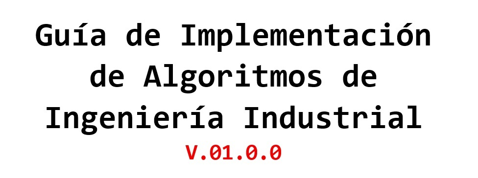

<a id='Home'><a/>

-----

## [**1. Introducción**](1_Introduccion/1_Introduccion.ipynb#1_Introduccion) <!--()-->    

#### [1.1. Presentación](1_Introduccion/1_Introduccion.ipynb#1.1_Presentacion) <!--()-->  
#### [1.2. Instalación](1_Introduccion/1_Introduccion.ipynb#1.2_Instalacion) <!--()-->    
#### [1.3. Algunos IDE](1_Introduccion/1_3_Algunos_IDE/1_3_1_IDLE/1_3_1_IDLE.ipynb#1.3_Algunos_IDE) <!--()--> 
>[1.3.1. IDLE](1_Introduccion/1_3_Algunos_IDE/1_3_1_IDLE/1_3_1_IDLE.ipynb#1.3.1_IDLE) <!--()-->  
[1.3.2. Jupyter](1_Introduccion/1_3_Algunos_IDE/1_3_2_JupyterLab/1_3_2_JupyterLab.ipynb#1.3.2_JupyterLab) <!--()-->  

#### [1.4 Instrucciones Guía Interactiva](1_Introduccion/1_4_Instrucciones_Guia_Interactiva/1_4_Instrucciones_Guia_Interactiva.ipynb#1.4_Insutrucciones-Guia-Interactiva) <!--()-->  

## [**2. Elementos Básicos**](2_Elementos_Basicos/2_Elementos_Basicos.ipynb#2_Elementos-Basicos) <!--()-->

#### [2.1 Variables](2_Elementos_Basicos/2_Elementos_Basicos.ipynb#2.1_Variables)  <!--()-->  
#### [2.2 Operadores Aritméticos](2_Elementos_Basicos/2_Elementos_Basicos.ipynb#2.2_Operadores-Aritmeticos) <!--()-->  
#### [2.3 Ayuda y Directorio](2_Elementos_Basicos/2_Elementos_Basicos.ipynb#2.3_Ayuda-y-Directorio) <!--()-->  
#### [2.4 Programas en Python](2_Elementos_Basicos/2_4_Programas_en_Python/2_4_Programas_en_Python.ipynb#2-4_Programas-en-Python) <!--()-->  
>[2.4.1 Análisis del Problema](2_Elementos_Basicos/2_4_Programas_en_Python/2_4_Programas_en_Python.ipynb#2.4.1_Analsis) <!--()-->  
[2.4.2 Código en Python](2_Elementos_Basicos/2_4_Programas_en_Python/2_4_Programas_en_Python.ipynb#2.4.2_Codigo-en-Python) <!--()-->  

## [**3. Estructuras Lógicas**](3_Estructuras_Logicas/3_Estructuras_Logicas.ipynb#3_Estructuras-Logicas) <!--()-->  

#### [3.1 Estructuras de Decisión](3_Estructuras_Logicas/3_Estructuras_Logicas.ipynb#3.1_Estructuras-de-Decision) <!--()--> 
>[3.1.1. Bloque if](3_Estructuras_Logicas/3_Estructuras_Logicas.ipynb#Min-eje_Bloque-if)  <!--()-->   
[3.1.2. Bloque if - else](3_Estructuras_Logicas/3_Estructuras_Logicas.ipynb#Min-eje_Bloque-if-else)  <!--()-->   
[3.1.3. Bloque if - elif - else](3_Estructuras_Logicas/3_Estructuras_Logicas.ipynb#Min-eje_Bloque-if-elif-else)  <!--()-->   
#### [3.2 Operadores](3_Estructuras_Logicas/3_Estructuras_Logicas.ipynb#3.2_Operaradores) <!--()-->

## [**4. Bucles e Iterables**](4_Bucles_e_Iterables/4_Bucles_e_Iterables.ipynb#4_Bucles-e-Iterables) <!--()-->

#### [4.1. Iterables](4_Bucles_e_Iterables/4_Bucles_e_Iterables.ipynb#4.1_Iterables) <!--()-->   
#### [4.2. Estructuras de Repetición](4_Bucles_e_Iterables/4_Bucles_e_Iterables.ipynb#4.2_Estructuras-de-Repeticion) <!--()-->  
>[4.2.1. Bloque for](4_Bucles_e_Iterables/4_Bucles_e_Iterables.ipynb#4.2.1_Bloque-for) <!--()-->  
[4.2.2. Bloque while](4_Bucles_e_Iterables/4_Bucles_e_Iterables.ipynb#4.2.2_Bloque-while) <!--()-->  
[4.2.3. Controladores de Bucles](4_Bucles_e_Iterables/4_Bucles_e_Iterables.ipynb#4.2.3_Controladores-de-Bucles) <!--()-->  

## [**5. Estructuras de Datos Básicas**](5_Estructura_de_Datos/5_Estructura_de_Datos.ipynb#5_Estructura-de-Datos-Basicas) <!--()-->

#### [5.1. Listas](5_Estructura_de_Datos/5_Estructura_de_Datos.ipynb#5.1_Listas) <!--()-->   
>[5.1.1. Métodos de las Listas](5_Estructura_de_Datos/5_Estructura_de_Datos.ipynb#5.1.1_Metodos-de-las-Listas) <!--()-->  
[5.1.2. Operaciones](5_Estructura_de_Datos/5_Estructura_de_Datos.ipynb#5.1.2_Operaciones) <!--()-->  
[5.1.3. Listas Anidadas](5_Estructura_de_Datos/5_Estructura_de_Datos.ipynb#5.1.3_Listas-Anidadas) <!--()-->  
#### [5.2. Tuplas](5_Estructura_de_Datos/5_Estructura_de_Datos.ipynb#5.2_Tuplas) <!--()-->   
#### [5.3. Diccionarios](5_Estructura_de_Datos/5_Estructura_de_Datos.ipynb#5.3_Diccionarios)    

## [**6. Funciones**](6_Funciones/6_Funciones.ipynb#6_Funciones) <!--()-->

#### [6.1. Declaración](6_Funciones/6_Funciones.ipynb#6.1_declaracion)   
>[6.1.1. Tipos de Declaración](6_Funciones/6_Funciones.ipynb#6.1.1_tipos-de-Declaracion)  
[6.1.2. Función Lambda](6_Funciones/6_Funciones.ipynb#6.1.2_Funcion-Lamda)   
[6.1.3. Documentación](6_Funciones/6_Funciones.ipynb#6.1.3_Documentacion)
#### [6.2. Argumentos](#6.2_Argumentos)  
>[6.2.1. Argumentos Obligatorios](6_Funciones/6_Funciones.ipynb#6.2.1_Argumentos-Obligatorios)  
[6.2.2. Argumentos Opcionales](6_Funciones/6_Funciones.ipynb#6.2.2_Argumentos-Opcionales)
#### [6.3. Funciones Recursivas](6_Funciones/6_Funciones.ipynb#6.3_Funciones-Recursivas)   
#### [6.4. Validaciones](6_Funciones/6_Funciones.ipynb#6.4.2_Validacion_de_Entradas)   
>[6.4.1. Excepciones](6_Funciones/6_Funciones.ipynb#6.4.1_Excepciones)    
[6.4.2. Validación de Entradas](6_Funciones/6_Funciones.ipynb#6.4.2_Validacion_de_Entradas)  

## [**7. Lectura y Escritura de Archivos**](7_Lectura_y_Escritura/7_Lectura_y_Escritura.ipynb#7_Lectura_y_Escritura) <!--()-->

#### [7.1. Lectura](7_Lectura_y_Escritura/7_Lectura_y_Escritura.ipynb#7.1_Lectura)   
>[7.1.1. Ubicación de Archivos](7_Lectura_y_Escritura/7_Lectura_y_Escritura.ipynb#7.1.1_Ubicacion-de-Archivos)    
[7.1.2. Almacenar Datos](7_Lectura_y_Escritura/7_Lectura_y_Escritura.ipynb#7.1.2_Almacenar-Datas)   
#### [7.2. Escritura](7_Lectura_y_Escritura/7_Lectura_y_Escritura.ipynb#7.2_Escritura)    
>[7.2.1. Crear Carpetas](7_Lectura_y_Escritura/7_Lectura_y_Escritura.ipynb#7.2.1_Crear-Carpetas)
#### [7.3. Crear Archivos .xlsx](7_Lectura_y_Escritura/7_Lectura_y_Escritura.ipynb#7.3_Archivos-xlsx)  
>[7.3.1. Crear los DataFrames](7_Lectura_y_Escritura/7_Lectura_y_Escritura.ipynb#7.3.1_Crear-los-DataFrames)    
[7.3.2. Crear y Editar el Documento](7_Lectura_y_Escritura/7_Lectura_y_Escritura.ipynb#7.3.2_Crear-y-Editar-el-Documento)     
[7.3.3. Aplicar Títulos y Formatos](7_Lectura_y_Escritura/7_Lectura_y_Escritura.ipynb#7.3.3_Aplicar-Títulos-y-Formatos)  

## [**8. Gráficos**](8_Graficos/8_Graficos.ipynb#8_Graficos) <!--()-->

### [8.1. Gráficos 2D](8_Graficos/8_Graficos.ipynb#8.1_Graficos_2D)
>[8.1.1. Propiedades Líneas 2D](8_Graficos/8_Graficos.ipynb#8.1.1_Lineas_2D)    
[8.1.2. Modificadores de Estílo](8_Graficos/8_Graficos.ipynb#8.1.2_Modificadores-de-Estilo)    
[8.1.3. Líneas y Disperción](8_Graficos/8_Graficos.ipynb#8.1.3_Lineas_y_Dispercion)   
[8.1.4. Histograma](8_Graficos/8_Graficos.ipynb#8.1.4_Histograma) 

## [**9. Módulos y Paquetes**](9_Modulos/9_Modulos_y_Paquetes.ipynb#9_Modulos_y_Paquetes) <!--()-->

#### [9.1. Módulos](9_Modulos/9_Modulos_y_Paquetes.ipynb#9.1_Modulos)   
>[9.1.1. Importar Módulos](9_Modulos/9_Modulos_y_Paquetes.ipynb#9.1.1_Importar-Modulos)      

#### [9.2. Paquetes](9_Modulos/9_Modulos_y_Paquetes.ipynb#9.2_Paquetes)   
>[9.2.1. Importar Paquetes](9_Modulos/9_Modulos_y_Paquetes.ipynb#9.2.1_Importar-Paquetes)     

#### [9.3. Librería Estándar](9_Modulos/9_Modulos_y_Paquetes.ipynb#9.3_Libreria-Estandar)  

#### [9.4. Paquetes de Terceros](9_Modulos/9_Modulos_y_Paquetes.ipynb#9.4_Paqutes-de-Terceros)   
>[9.4.1. Instalación de Paquetes](9_Modulos/9_Modulos_y_Paquetes.ipynb#9.4.1_Instalacion-de-Paquetes)   
[9.4.2. Instalación de pip](9_Modulos/9_Modulos_y_Paquetes.ipynb#9.4.2_Instalacion_de_pip)   

## [**10. Prácticas**](10_Practicas/10_Practicas.ipynb#10_Practicas) <!--()-->

---

|  | | | | **Estephania Calvo Carvajal**   estephania.calvo@correounivalle.edu.co  |
| :--------: |:--------: |:--------: |:--------: |:--------: |
